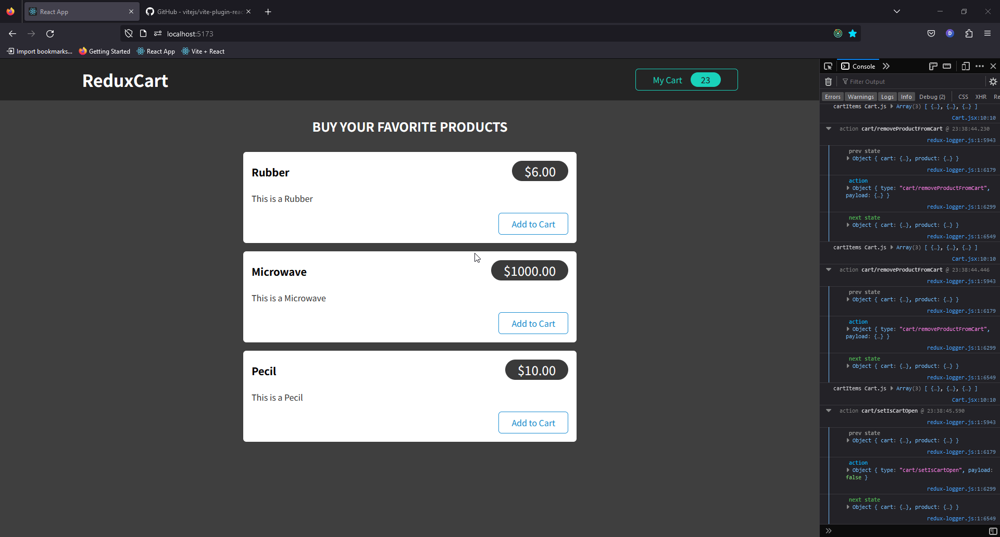

React Practice
---
Reference Source Code: https://www.udemy.com/course/react-the-complete-guide-incl-redux/
 
I am practice migration from `React-Create-App` to `Vite` project and practice using Vite + React + Redux Toolkit + Redux Logger to do simple shop 1 page.

- Toggle cart
- Add product to cart
- Decrease product in cart
- Remove product from Cart
- Recalculate cart price on change
- Recount cart items on change
- Recount cart total items on change



---
Installation
---
You can select package manager (npm / yarn / pnpm) up to your own package manager (This example using pnpm)

Install Dependencies
``` bash
pnpm install
```

Start Application
``` bash
pnpm start
```
